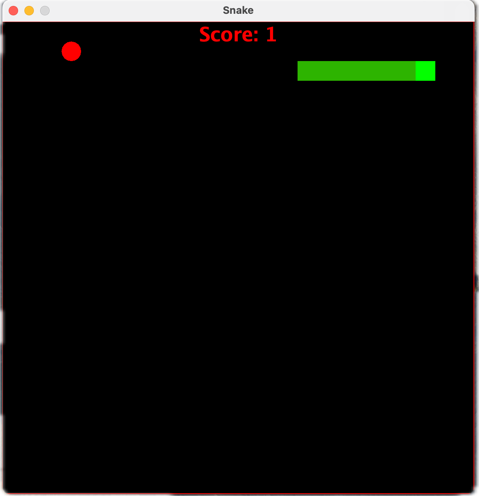
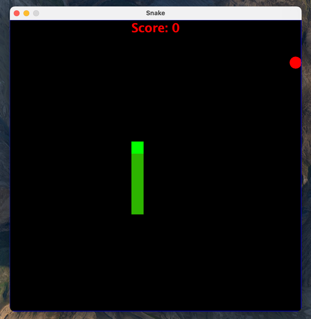
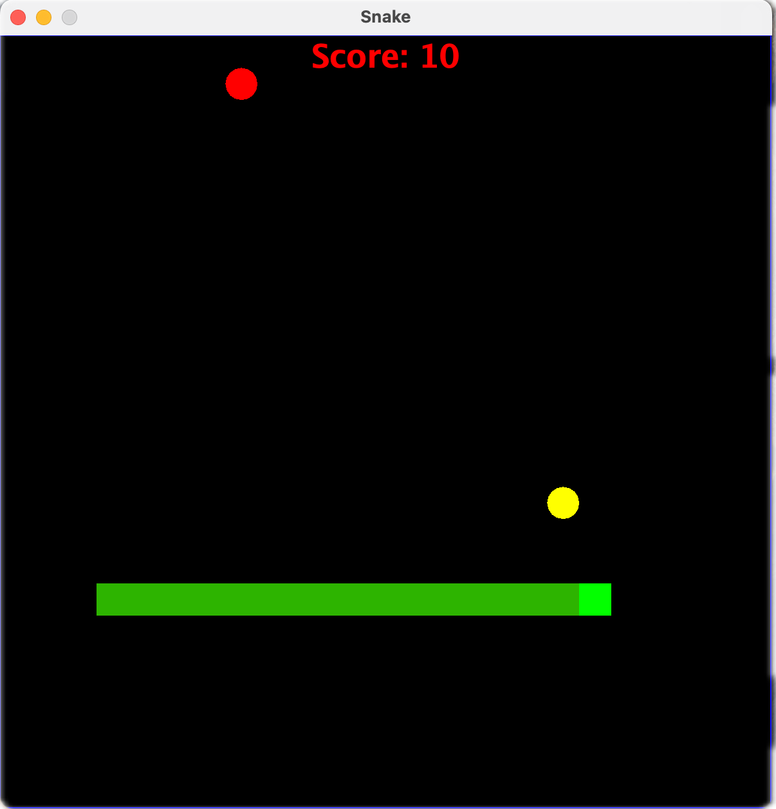
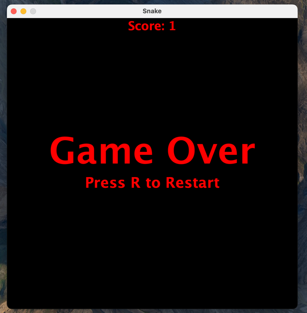

# Snake Game in Java

A simple Snake game built in Java using **Swing** and **AWT** for the graphical interface.

## Features
✅ Classic Snake mechanics with smooth movement
✅ Borderless mode (Press `B` to toggle)
✅ Golden Apples for bonus points and speed boost
✅ Score display and Game Over screen
✅ Restart option (`R` key)

## How to Play
- **Arrow Keys (`⬅️⬆️⬇️➡️`)**: Control the Snake's movement.
- **Eat Red Apples** 🍎 to grow and score points.
- **Golden Apples** ⭐ appear every 5 apples—eat them for extra points and speed boost.
- **Borderless Mode** 🔄: Press `B` to enable/disable walls.
- **Restart Game** 🔄: Press `R` after Game Over.

## Installation
1. Clone the repository:
   ```sh
   git clone https://github.com/yourusername/snake-game-java.git
   ```
2. Compile the game:
   ```sh
   javac GamePanel.java
   ```
3. Run the game:
   ```sh
   java GamePanel
   ```

## Dependencies
- Java 8 or higher

## Screenshots

### Normal Mode  
  

### Borderless Mode  
  

### Golden Apple Active  
  

### Game Over Screen  
  
## Contributing
Pull requests are welcome! Feel free to improve the game or add new features.

## License
This project is licensed under the MIT License.

